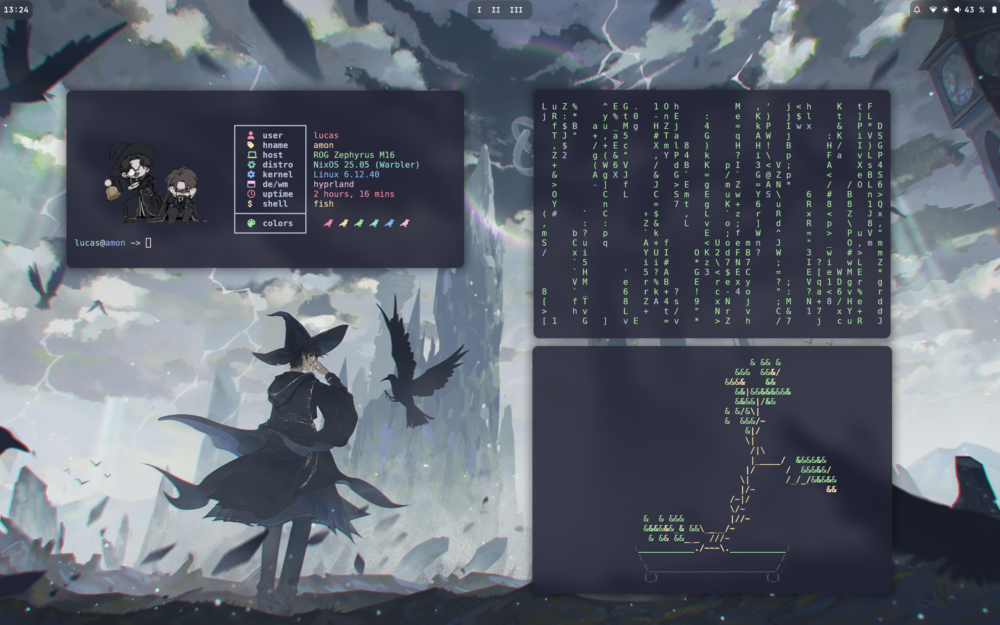
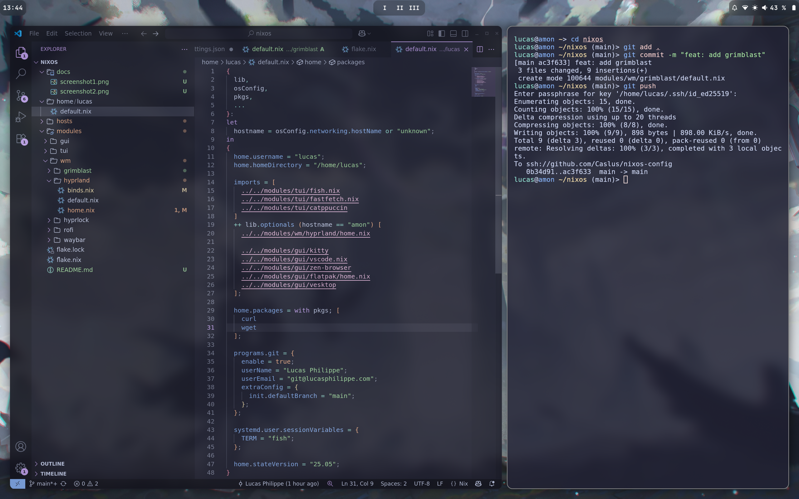
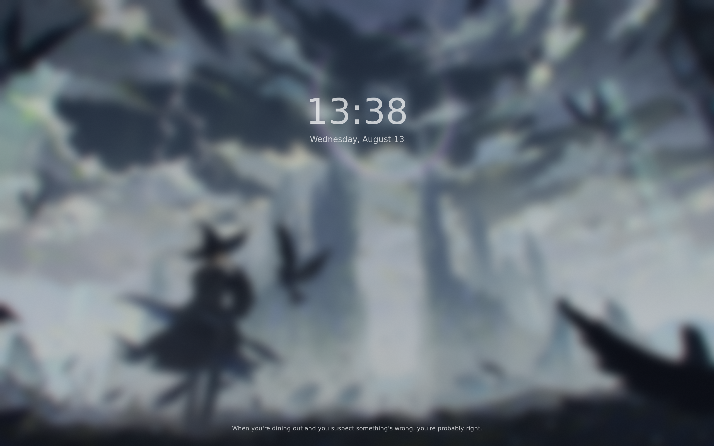

<h1 align="center">
    
   <br>
      Caslus/nixos-config
   <br>
       <br>

   <div align="center">
      <p></p>
      <div align="center">
         <a href="https://github.com/Caslus/nixos-config/stargazers">
            
         </a>
         <a = href="https://nixos.org">
            
         </a>
      </div>
   </div>
</h1>

Welcome! This repository contains my personal [NixOS](https://nixos.org/) configuration, organized for multiple hosts and modularity. 

It’s a learning project, expect some experimentation and non-standard practices.

> [!WARNING]
> This is my first time using Nix and NixOS. I prioritized convenience and learning over best practices.

---

<details open>
<summary>

## 🖼️ Screenshots

</summary>



</details>

---

## 📁 Repository Layout

```
nixos-config/
├── flake.nix         # Entrypoint (flake-based setup)
├── flake.lock        # Flake lock file
├── hosts/            # Host-specific system configs
│   ├── amon/         # Main laptop
│   └── nixos/        # Virtual machine for testing
├── home/             # User-specific configs
│   └── lucas/        # User 'lucas' configuration
├── modules/          # Modular application configs
│   ├── wm/           # Window manager & related
│   ├── gui/          # GUI applications
│   └── tui/          # Terminal applications
└── docs/             # Documentation
```

---

## 🧩 Components

| Component                | Technology/Module                  |
|--------------------------|------------------------------------|
| **Window Manager**       | [Hyprland][Hyprland]               |
| **Bar**                  | [Waybar][Waybar]                   |
| **Application Launcher** | [rofi-wayland][rofi-wayland]       |
| **Notification Daemon**  | [dunst][dunst]                     |
| **Terminal Emulator**    | [kitty][kitty]                     |
| **Shell**                | [fish][fish]                       |
| **System Info**          | [fastfetch][fastfetch]             |
| **Text Editor**          | [VSCode][VSCode]                   |
| **Networking**           | [NetworkManager][NetworkManager]   |
| **Color Scheme**         | [Catppuccin Mocha][Catppuccin]     |
| **Cursor**               | [McMojave][McMojave]               |
| **Lockscreen**           | [Hyprlock][Hyprlock]               |
| **Browser**              | [Zen Browser][ZenBrowser]          |
| **Flatpak Integration**  | [nix-flatpak][nix-flatpak]         |

---

## 🚀 Getting Started

> [!WARNING]
> This setup is tested only on my machines. It might need adjustments to work for you.

1. **Clone this repo**  
   ```sh
   git clone https://github.com/Caslus/nixos-config.git
   cd nixos-config
   ```

2. **Review and edit host/user configs**  
   Adjust files in `hosts/` and `home/` as needed for your hardware and preferences.

3. **Rebuild your system**  
   ```sh
   sudo nixos-rebuild switch --flake .#amon
   ```
   Replace `amon` with your target host if needed.

4. **Update flake inputs**  
   ```sh
   nix flake update
   ```

---

## 📝 Notes

- **Modularity:**  
  Most configuration is split into reusable modules under [`modules/`](modules/).
- **Home Manager:**  
  User environments are managed via [Home Manager](https://nix-community.github.io/home-manager/).
- **Flakes:**  
  This setup uses Nix flakes for reproducibility and easy updates.


[Hyprland]: https://github.com/hyprwm/Hyprland  
[Waybar]: https://github.com/Alexays/Waybar  
[rofi-wayland]: https://github.com/in0ni/rofi-wayland  
[dunst]: https://github.com/dunst-project/dunst
[kitty]: https://github.com/kovidgoyal/kitty  
[fish]: https://github.com/fish-shell/fish-shell  
[VSCode]: https://github.com/microsoft/vscode  
[NetworkManager]: https://wiki.gnome.org/Projects/NetworkManager  
[Catppuccin]: https://github.com/catppuccin/catppuccin  
[McMojave]: https://github.com/Libadoxon/mcmojave-hyprcursor  
[Hyprlock]: https://github.com/hyprwm/hyprlock  
[ZenBrowser]: https://github.com/0xc000022070/zen-browser-flake
[nix-flatpak]: https://github.com/gmodena/nix-flatpak
[fastfetch]: https://github.com/fastfetch-cli/fastfetch